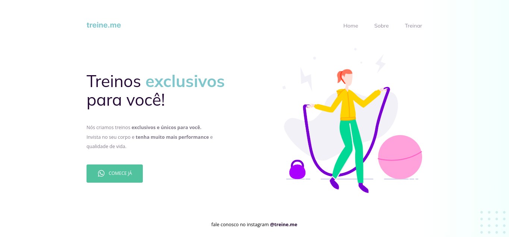

# Fixing bugs 02 - Stage 02 (Explorer)

### Used languages: HTML e CSS

=> In this other challenge I received a different code from the first one but it was also broken and the goal was to fix it and leave it the way it's on Figma.

## Broken

##

## Finished

